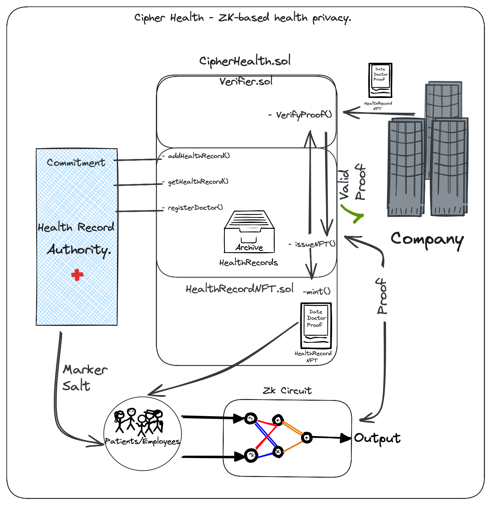
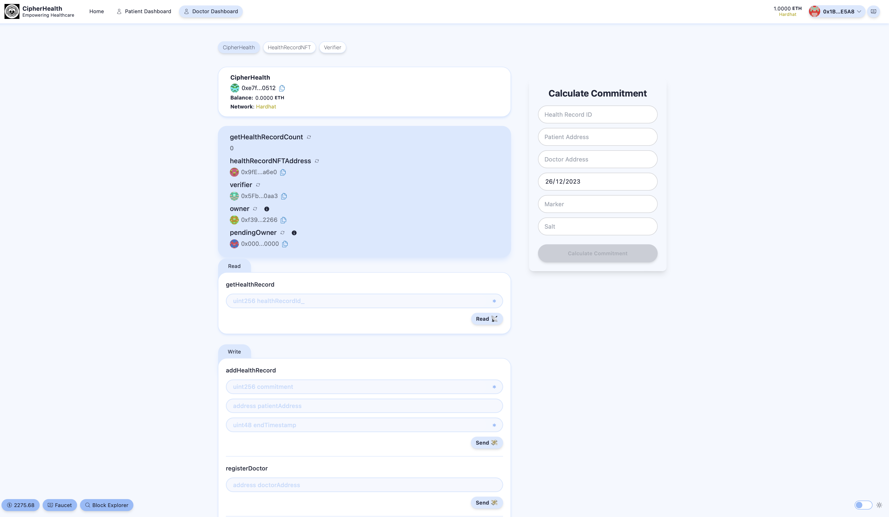

# ⚕️ Cipher Health: Enhancing Privacy in Health Records Using Blockchain and Zero-Knowledge Proofs

## Introduction

### The Challenge

In the modern healthcare system, there's a crucial need to balance the accessibility of health records for operational purposes and the privacy of individuals' health information. Traditional methods often lead to unintended disclosure of sensitive health data, raising privacy and ethical concerns.

### Our Solution: Cipher Health
Cipher Health addresses this challenge by leveraging blockchain technology and Zero-Knowledge Proofs (ZKPs) to create a secure, transparent, and privacy-preserving health record system.

## Why Zero-Knowledge Proofs and Blockchain?

### Blockchain: Transparency and Immutability
- **Immutable Records**: Once health records are stored on the blockchain, they cannot be altered, ensuring the integrity of the data.
- **Decentralization**: Eliminates reliance on centralized servers, reducing the risk of data manipulation or loss.
- **Transparency**: Ensures transparency in the process while maintaining privacy, which is critical in healthcare operations.

### Zero-Knowledge Proofs: Privacy Without Compromise
- **Confidentiality**: Allows patients to prove their health status without revealing the exact illness or condition.
- **Selective Disclosure**: Patients control what information they share, enhancing privacy and security.
- **Trust**: Builds trust between parties, as the verifier knows the information is accurate without needing to see it.

## The CipherHealth dApp

### Overview
Cipher Health dApp is a decentralized application that enables patients to prove their sickness without revealing their identity or the specifics of their disease.


### Key Components

1. **Health Records**:
   - Stored on the blockchain, ensuring immutability and security.
   - Contains information such as doctor's address, endTimestamp, and patientAddress.
   - Uses a commitment model to keep sensitive information secret.

2. **Commitment**:
   - A cryptographic commitment hides the actual disease marker.
   - Allows proof of sickness without revealing specifics.

3. **HealthRecordNFT**:
   - A unique, soulbound token representing the patient's health record.
   - Minted by the patient using a proof generated with their secret parameters (disease marker and salt).
   - Verifiable and links to the patient's record without revealing sensitive data.

## Circom Circuit: Ensuring Privacy and Integrity

### Circuit Design
The Circom circuit is designed to generate a cryptographic proof, ensuring that the patient knows the secret parameters of their health record without revealing them.

### Workflow
1. **Inputs**: The circuit takes both public (healthRecordId, commitment, patientAddress, doctorAddress, endTimestamp) and private inputs (marker, salt).
2. **Commitment Calculation**: Using Poseidon hash, it computes a commitment from these inputs.
3. **Proof Generation**: The circuit outputs a proof that this commitment corresponds to a valid health record.

## Smart Contract: CipherHealth

### Functions
- **addHealthRecord**: Adds a new health record to the blockchain.
- **issueNFT**: Issues a HealthRecordNFT based on valid proof provided by the patient.
- **registerDoctor and registerOperator**: For managing access and authorizations.

### Security and Permissions
- Uses `Ownable2Step` for critical operations, requiring two-step verification.
- Verifies doctors and operators to ensure only authorized individuals can interact with the system.

## Conclusion

CipherHealth stands as a revolutionary step in healthcare data management. By harnessing blockchain and ZKP, it offers a unique solution that maintains the confidentiality of health data while ensuring its availability for necessary verification processes. This system not only enhances data privacy but also streamlines the healthcare process, making it more efficient and trustworthy.

## Requirements

Before you begin, you need to install the following tools:

- [Node (v18 LTS)](https://nodejs.org/en/download/)
- Yarn ([v1](https://classic.yarnpkg.com/en/docs/install/) or [v2+](https://yarnpkg.com/getting-started/install))
- [Git](https://git-scm.com/downloads)

## Quickstart

To get started with Cipher Health, follow the steps below:

1. Clone this repo & install dependencies

```
git clone https://github.com/vaniiiii/CipherHealth.git
cd CipherHealth
yarn install
```

2. Run a local network in the first terminal:

```
yarn chain
```

This command starts a local Ethereum network using Hardhat. The network runs on your local machine and can be used for testing and development. You can customize the network configuration in `hardhat.config.ts`.

3. On a second terminal, deploy the test contract:

```
yarn deploy
```

This command deploys a test smart contract to the local network. The contract is located in `packages/hardhat/contracts` and can be modified to suit your needs. The `yarn deploy` command uses the deploy script located in `packages/hardhat/deploy` to deploy the contract to the network. You can also customize the deploy script.

4. On a third terminal, start your NextJS app:

```
yarn start
```

Visit app on: `http://localhost:3000`. You can interact with your smart contract using the `Doctor dashboard` and `Patient dashboard` pages. You can tweak the app config in `packages/nextjs/scaffold.config.ts`.

Run smart contract and zk circuit test with `yarn hardhat:test`

## Page Interaction

### Doctor Dashboard


### Patient Dashboard


## Note
Project was built on top of Scaffold-ETH 2 template. Visit [docs](https://docs.scaffoldeth.io) to learn how to start building with Scaffold-ETH 2.

To know more about its features, check out [website](https://scaffoldeth.io).

